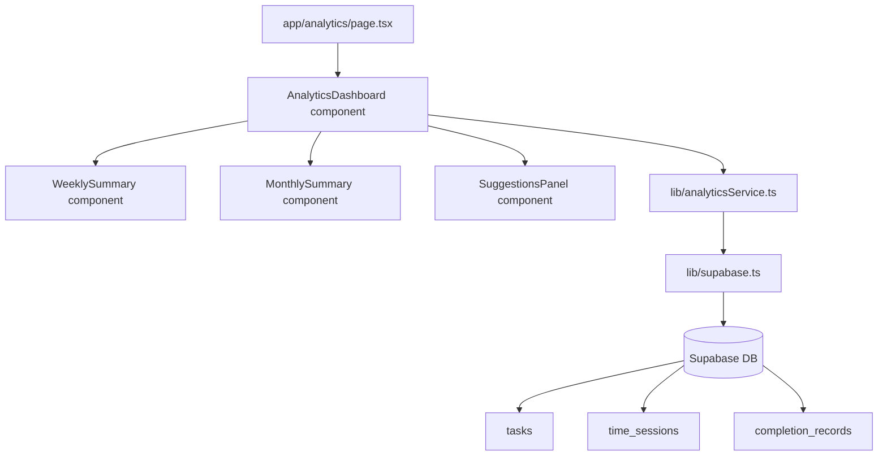
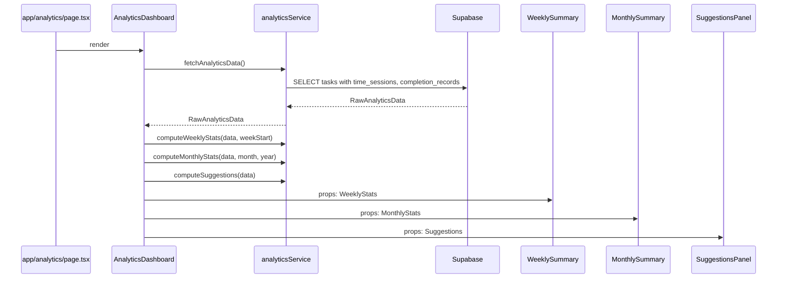
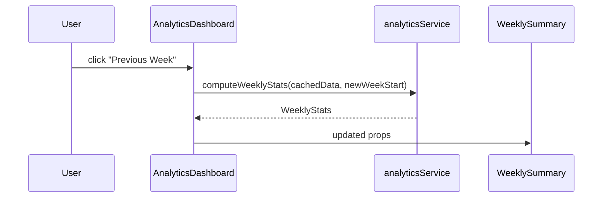

# Design Document: Analytics Summaries

## Overview

The Analytics Summaries feature processes existing task and time-tracking data already stored in Supabase to produce weekly summaries, monthly summaries, and productivity suggestions for the user. All computation happens client-side by aggregating from the `tasks`, `time_sessions`, and `completion_records` tables — no new database tables are required.

The feature adds a new `/analytics` route with three panels: a weekly summary, a monthly summary, and a suggestions panel. Data is fetched once on mount and all aggregation runs in pure TypeScript functions in `lib/analyticsService.ts`.

---

## Architecture



All Supabase queries are issued from `lib/analyticsService.ts`. The `AnalyticsDashboard` component fetches raw data once, passes it through the aggregation functions, and distributes the resulting typed structs to the three display components as props. No new Supabase tables or Edge Functions are needed.

---

## Sequence Diagrams

### Analytics Page Load



### Period Navigation



Period navigation (previous/next week or month) re-runs the pure aggregation functions against the already-fetched data — no additional Supabase calls.

---

## Components and Interfaces

### New Components

| Component | Path | Role |
|---|---|---|
| `AnalyticsDashboard` | `app/components/AnalyticsDashboard.tsx` | Fetches raw data, runs aggregations, owns period navigation state, distributes props |
| `WeeklySummary` | `app/components/WeeklySummary.tsx` | Displays weekly stats: task counts by outcome, hours worked, busiest day, longest task |
| `MonthlySummary` | `app/components/MonthlySummary.tsx` | Displays monthly stats: same as weekly plus per-subject breakdowns |
| `SuggestionsPanel` | `app/components/SuggestionsPanel.tsx` | Displays productivity suggestions derived from historical patterns |

### New Page

| Path | Role |
|---|---|
| `app/analytics/page.tsx` | Route entry point; renders `<AnalyticsDashboard />` |

### New Service

| Path | Role |
|---|---|
| `lib/analyticsService.ts` | All data fetching and pure aggregation functions |

### Component Interfaces

```typescript
// AnalyticsDashboard — no external props, owns all state
function AnalyticsDashboard(): JSX.Element

// WeeklySummary
interface WeeklySummaryProps {
  stats: WeeklyStats
  weekStart: Date
  onPrevWeek: () => void
  onNextWeek: () => void
  isCurrentWeek: boolean
}

// MonthlySummary
interface MonthlySummaryProps {
  stats: MonthlyStats
  month: number   // 0-indexed
  year: number
  onPrevMonth: () => void
  onNextMonth: () => void
  isCurrentMonth: boolean
}

// SuggestionsPanel
interface SuggestionsPanelProps {
  suggestions: Suggestions
}
```

---

## Data Models

### Raw Data (fetched from Supabase)

```typescript
interface RawAnalyticsData {
  tasks: Task[]                          // includes time_sessions and completion_records
}
```

The existing `fetchAllTasks()` already fetches `time_sessions` and `completion_records` via Supabase's nested select. `analyticsService.fetchAnalyticsData()` reuses the same query pattern, scoped to completed tasks only for efficiency.

### Aggregated Stats Types

```typescript
// Outcome counts shared by both weekly and monthly
interface OutcomeCounts {
  completed: number        // total tasks with a completion_record
  aheadOfTime: number      // outcome === 'ahead of time'
  onTime: number           // outcome === 'on time'
  overdue: number          // outcome === 'overdue'
}

// Per-subject breakdown used in monthly stats
interface SubjectStats {
  subject: string
  totalSeconds: number
  outcomes: OutcomeCounts
}

// Weekly aggregated stats
interface WeeklyStats {
  weekStart: string                  // ISO date of Monday
  weekEnd: string                    // ISO date of Sunday
  outcomes: OutcomeCounts
  totalSeconds: number               // sum of all time_session durations in the week
  busiestDay: string | null          // day name e.g. 'Monday', null if no sessions
  longestTask: { name: string; subject: string; totalSeconds: number } | null
}

// Monthly aggregated stats
interface MonthlyStats {
  month: number                      // 0-indexed
  year: number
  outcomes: OutcomeCounts
  totalSeconds: number
  busiestDay: string | null
  longestTask: { name: string; subject: string; totalSeconds: number } | null
  subjectStats: SubjectStats[]       // sorted by totalSeconds desc
  mostTimeSubject: string | null
  leastTimeSubject: string | null    // only subjects with > 0 seconds
  subjectMostCompleted: string | null
  subjectMostOverdue: string | null
  subjectMostAheadOfTime: string | null
}

// Suggestions derived from all historical data
interface Suggestions {
  focusSubjects: string[]            // subjects with high overdue rate
  mostProductiveDays: string[]       // day names with highest completion rate
  mostProductiveHours: number[]      // hours (0-23) with most sessions started
  avoidSubjects: string[]            // subjects with consistently low completion
}
```

### Supabase Query

```typescript
// analyticsService.ts — single query, all data needed for analytics
const { data, error } = await supabase
  .from('tasks')
  .select(`
    id, name, subject, status, due_date, created_at,
    time_sessions ( id, task_id, started_at, ended_at ),
    completion_records ( id, task_id, completed_at, due_date, outcome )
  `)
  .order('created_at', { ascending: false })
```

No date filtering at the query level — all tasks are fetched and period filtering is done in the aggregation functions. This keeps the data layer simple and allows period navigation without re-fetching.

---

## Key Functions with Formal Specifications

### `fetchAnalyticsData`

```typescript
async function fetchAnalyticsData(): Promise<RawAnalyticsData>
```

**Preconditions:**
- Supabase client is initialized
- `tasks`, `time_sessions`, `completion_records` tables exist

**Postconditions:**
- Returns all tasks with their nested `time_sessions` and `completion_records`
- Throws on Supabase error

---

### `computeWeeklyStats`

```typescript
function computeWeeklyStats(data: RawAnalyticsData, weekStart: Date): WeeklyStats
```

**Preconditions:**
- `weekStart` is a Monday (day index 1) at midnight UTC
- `data.tasks` is a valid array (may be empty)

**Postconditions:**
- Only tasks whose `completion_records[0].completed_at` falls within `[weekStart, weekStart + 7 days)` are counted in `outcomes`
- Only `time_sessions` whose `started_at` falls within the same window contribute to `totalSeconds` and `busiestDay`
- `busiestDay` is the day name with the highest total session seconds; `null` if no sessions exist in the window
- `longestTask` is the task with the highest total session seconds in the window; `null` if no sessions exist
- `outcomes.completed === outcomes.aheadOfTime + outcomes.onTime + outcomes.overdue`

**Loop Invariants:**
- When iterating sessions to accumulate `totalSeconds`, all previously processed sessions had `ended_at !== null`
- When building the day-bucket map, each session is assigned to exactly one day bucket

---

### `computeMonthlyStats`

```typescript
function computeMonthlyStats(data: RawAnalyticsData, month: number, year: number): MonthlyStats
```

**Preconditions:**
- `month` is in range `[0, 11]`
- `year` is a positive integer
- `data.tasks` is a valid array (may be empty)

**Postconditions:**
- Only tasks/sessions whose relevant timestamp falls within the calendar month `[year, month]` are included
- `subjectStats` contains one entry per distinct subject that has any activity in the month
- `mostTimeSubject` is the subject with the highest `totalSeconds`; `null` if no sessions
- `leastTimeSubject` is the subject with the lowest `totalSeconds > 0`; `null` if fewer than 2 subjects have time
- `subjectMostCompleted`, `subjectMostOverdue`, `subjectMostAheadOfTime` are the subjects with the highest count of each outcome; `null` if no completions
- All weekly postconditions apply to the monthly equivalents

**Loop Invariants:**
- When building `subjectStats`, each task is assigned to exactly one subject bucket
- Subject outcome counts sum to the total outcome counts

---

### `computeSuggestions`

```typescript
function computeSuggestions(data: RawAnalyticsData): Suggestions
```

**Preconditions:**
- `data.tasks` is a valid array (may be empty)

**Postconditions:**
- `focusSubjects`: subjects where `overdue / completed > 0.5` and `completed >= 2`; empty array if no qualifying subjects
- `mostProductiveDays`: up to 3 day names ranked by `(aheadOfTime + onTime) / completed` ratio, considering only days with `completed >= 2`; empty array if insufficient data
- `mostProductiveHours`: up to 3 hours (0–23) ranked by count of sessions started in that hour; empty array if no sessions
- `avoidSubjects`: subjects where `overdue / completed > 0.7` and `completed >= 3`; empty array if no qualifying subjects
- All arrays are sorted descending by their ranking metric
- No subject appears in both `focusSubjects` and `avoidSubjects`

---

### `getWeekStart`

```typescript
function getWeekStart(date: Date): Date
```

**Postconditions:**
- Returns a new `Date` set to the Monday of the week containing `date`, at midnight UTC
- Does not mutate `date`

---

### `sessionDurationSeconds`

```typescript
function sessionDurationSeconds(session: TimeSession): number
```

**Preconditions:**
- `session.ended_at` is non-null

**Postconditions:**
- Returns `Math.floor((ended_at_ms - started_at_ms) / 1000)`
- Returns `0` if `ended_at <= started_at` (guards against clock skew)

---

### `filterSessionsInWindow`

```typescript
function filterSessionsInWindow(
  sessions: TimeSession[],
  windowStart: Date,
  windowEnd: Date
): TimeSession[]
```

**Postconditions:**
- Returns only sessions where `started_at >= windowStart && started_at < windowEnd`
- Excludes sessions with null `ended_at`
- Result is a subset of input; input is not mutated

---

### `filterCompletionsInWindow`

```typescript
function filterCompletionsInWindow(
  records: CompletionRecord[],
  windowStart: Date,
  windowEnd: Date
): CompletionRecord[]
```

**Postconditions:**
- Returns only records where `completed_at >= windowStart && completed_at < windowEnd`
- Result is a subset of input; input is not mutated

---

## Algorithmic Pseudocode

### computeWeeklyStats

```pascal
ALGORITHM computeWeeklyStats(data, weekStart)
INPUT: data: RawAnalyticsData, weekStart: Date (Monday midnight UTC)
OUTPUT: stats: WeeklyStats

BEGIN
  weekEnd ← weekStart + 7 days

  outcomes ← { completed: 0, aheadOfTime: 0, onTime: 0, overdue: 0 }
  totalSeconds ← 0
  dayBuckets ← Map<DayName, seconds>   // Mon–Sun → 0
  taskSeconds ← Map<taskId, seconds>

  FOR each task IN data.tasks DO
    // Accumulate time sessions in window
    windowSessions ← filterSessionsInWindow(task.time_sessions, weekStart, weekEnd)
    FOR each session IN windowSessions DO
      secs ← sessionDurationSeconds(session)
      totalSeconds ← totalSeconds + secs
      day ← dayName(session.started_at)
      dayBuckets[day] ← dayBuckets[day] + secs
      taskSeconds[task.id] ← taskSeconds[task.id] + secs
    END FOR

    // Accumulate completion outcomes in window
    windowCompletions ← filterCompletionsInWindow(task.completion_records, weekStart, weekEnd)
    FOR each record IN windowCompletions DO
      outcomes.completed ← outcomes.completed + 1
      IF record.outcome = 'ahead of time' THEN
        outcomes.aheadOfTime ← outcomes.aheadOfTime + 1
      ELSE IF record.outcome = 'on time' THEN
        outcomes.onTime ← outcomes.onTime + 1
      ELSE
        outcomes.overdue ← outcomes.overdue + 1
      END IF
    END FOR
  END FOR

  busiestDay ← key in dayBuckets with max value, or null if all zero
  longestTaskId ← key in taskSeconds with max value, or null if empty
  longestTask ← lookup task by longestTaskId, or null

  RETURN WeeklyStats {
    weekStart, weekEnd, outcomes, totalSeconds, busiestDay, longestTask
  }
END
```

### computeMonthlyStats

```pascal
ALGORITHM computeMonthlyStats(data, month, year)
INPUT: data: RawAnalyticsData, month: 0..11, year: integer
OUTPUT: stats: MonthlyStats

BEGIN
  monthStart ← Date(year, month, 1) at midnight UTC
  monthEnd   ← Date(year, month + 1, 1) at midnight UTC

  // Reuse weekly algorithm scoped to month window
  base ← computeWeeklyStats(data, monthStart) with windowEnd = monthEnd

  subjectMap ← Map<subject, SubjectStats>

  FOR each task IN data.tasks DO
    windowSessions ← filterSessionsInWindow(task.time_sessions, monthStart, monthEnd)
    windowCompletions ← filterCompletionsInWindow(task.completion_records, monthStart, monthEnd)

    IF windowSessions is empty AND windowCompletions is empty THEN
      CONTINUE
    END IF

    IF task.subject NOT IN subjectMap THEN
      subjectMap[task.subject] ← { subject, totalSeconds: 0, outcomes: zeroed }
    END IF

    FOR each session IN windowSessions DO
      subjectMap[task.subject].totalSeconds ← subjectMap[task.subject].totalSeconds + sessionDurationSeconds(session)
    END FOR

    FOR each record IN windowCompletions DO
      subjectMap[task.subject].outcomes ← increment by record.outcome
    END FOR
  END FOR

  subjectStats ← values of subjectMap sorted by totalSeconds DESC

  mostTimeSubject    ← subjectStats[0].subject if subjectStats non-empty, else null
  leastTimeSubject   ← last subject with totalSeconds > 0 if ≥ 2 subjects, else null
  subjectMostCompleted   ← subject with max outcomes.completed
  subjectMostOverdue     ← subject with max outcomes.overdue
  subjectMostAheadOfTime ← subject with max outcomes.aheadOfTime

  RETURN MonthlyStats { ...base fields, subjectStats, mostTimeSubject, leastTimeSubject,
                        subjectMostCompleted, subjectMostOverdue, subjectMostAheadOfTime }
END
```

### computeSuggestions

```pascal
ALGORITHM computeSuggestions(data)
INPUT: data: RawAnalyticsData
OUTPUT: suggestions: Suggestions

BEGIN
  subjectOutcomes ← Map<subject, OutcomeCounts>
  dayCompletions  ← Map<DayName, { completed, onTimeOrAhead }>
  hourCounts      ← Map<hour 0..23, count>

  FOR each task IN data.tasks DO
    FOR each record IN task.completion_records DO
      // Subject outcome accumulation
      subjectOutcomes[task.subject] ← increment by record.outcome

      // Day productivity accumulation
      day ← dayName(record.completed_at)
      dayCompletions[day].completed ← dayCompletions[day].completed + 1
      IF record.outcome ≠ 'overdue' THEN
        dayCompletions[day].onTimeOrAhead ← dayCompletions[day].onTimeOrAhead + 1
      END IF
    END FOR

    FOR each session IN task.time_sessions DO
      hour ← hour(session.started_at)
      hourCounts[hour] ← hourCounts[hour] + 1
    END FOR
  END FOR

  focusSubjects ← subjects where completed ≥ 2 AND overdue/completed > 0.5
                  sorted by overdue/completed DESC

  avoidSubjects ← subjects where completed ≥ 3 AND overdue/completed > 0.7
                  sorted by overdue/completed DESC
                  EXCLUDE any subject already in focusSubjects

  mostProductiveDays ← top 3 days by onTimeOrAhead/completed ratio
                       where completed ≥ 2

  mostProductiveHours ← top 3 hours by hourCounts value

  RETURN Suggestions { focusSubjects, mostProductiveDays, mostProductiveHours, avoidSubjects }
END
```

---

## Example Usage

```typescript
// app/components/AnalyticsDashboard.tsx (simplified)

const [rawData, setRawData] = useState<RawAnalyticsData | null>(null)
const [weekStart, setWeekStart] = useState(() => getWeekStart(new Date()))
const [month, setMonth] = useState(new Date().getMonth())
const [year, setYear] = useState(new Date().getFullYear())

useEffect(() => {
  fetchAnalyticsData().then(setRawData).catch(setError)
}, [])

const weeklyStats = rawData ? computeWeeklyStats(rawData, weekStart) : null
const monthlyStats = rawData ? computeMonthlyStats(rawData, month, year) : null
const suggestions = rawData ? computeSuggestions(rawData) : null
```

```typescript
// Example WeeklyStats output
{
  weekStart: '2025-07-14',
  weekEnd: '2025-07-20',
  outcomes: { completed: 5, aheadOfTime: 2, onTime: 2, overdue: 1 },
  totalSeconds: 14400,   // 4 hours
  busiestDay: 'Tuesday',
  longestTask: { name: 'Essay Draft', subject: 'English', totalSeconds: 5400 }
}

// Example Suggestions output
{
  focusSubjects: ['Chemistry', 'History'],
  mostProductiveDays: ['Tuesday', 'Thursday'],
  mostProductiveHours: [14, 10, 19],
  avoidSubjects: []
}
```

---

## Error Handling

| Scenario | Behavior |
|---|---|
| Supabase fetch error | `AnalyticsDashboard` shows error message in place of panels |
| No tasks in selected period | All panels render empty-state messages (zero counts, null fields) |
| Task with no time sessions | Excluded from time-based stats; still counted in outcome stats if completed |
| Task with no completion records | Excluded from outcome stats; still counted in time stats if sessions exist |
| Active session (null `ended_at`) | Excluded from all duration calculations |
| Insufficient data for suggestions | Affected suggestion arrays return empty; panel shows "not enough data yet" |

---

## Testing Strategy

### Unit Tests

Focus on:
- Boundary conditions for window filtering (session exactly at `windowStart`, exactly at `windowEnd`)
- `sessionDurationSeconds` with zero-duration and negative-duration guards
- `getWeekStart` for all 7 days of the week
- Empty data arrays producing zeroed/null stats
- `computeSuggestions` threshold boundaries (exactly 2 completions, exactly 50% overdue rate)

### Property-Based Tests

Library: **fast-check** (already used in the project)

Each property test must:
- Run a minimum of 100 iterations
- Include a comment tag: `// Feature: analytics-summaries, Property {N}: {property_text}`

---

## Correctness Properties

### Property 1: Outcome counts are internally consistent

*For any* `WeeklyStats` or `MonthlyStats`, `outcomes.completed === outcomes.aheadOfTime + outcomes.onTime + outcomes.overdue`.

**Validates: Requirement 2.3**

---

### Property 2: Only completed sessions contribute to totalSeconds

*For any* set of tasks, `totalSeconds` in weekly or monthly stats equals the sum of `sessionDurationSeconds(s)` for all sessions `s` where `s.ended_at !== null` and `s.started_at` falls within the window. Sessions with `ended_at === null` are never included.

**Validates: Requirements 2.2, 7.7**

---

### Property 3: Window filtering is exclusive of windowEnd

*For any* session with `started_at === windowEnd`, `filterSessionsInWindow` should NOT include it. *For any* session with `started_at === windowStart`, it SHOULD be included.

**Validates: Requirements 4.1, 4.2**

---

### Property 4: busiestDay is the day with the highest session seconds

*For any* set of sessions in a window, `busiestDay` is the day name `d` such that the sum of session seconds on day `d` is greater than or equal to the sum on any other day. If all days have zero seconds, `busiestDay` is `null`.

**Validates: Requirement 2.4**

---

### Property 5: longestTask is the task with the highest total session seconds

*For any* set of tasks with sessions in a window, `longestTask` is the task whose total session seconds is greater than or equal to all other tasks' totals. If no sessions exist, `longestTask` is `null`.

**Validates: Requirement 2.5**

---

### Property 6: subjectStats covers all active subjects exactly once

*For any* monthly window, every subject that has at least one session or completion record in the window appears in `subjectStats` exactly once, and no subject with zero activity appears.

**Validates: Requirement 3.2**

---

### Property 7: Subject outcome counts sum to total outcome counts

*For any* `MonthlyStats`, the sum of `subjectStats[i].outcomes.completed` across all subjects equals `outcomes.completed`, and similarly for `aheadOfTime`, `onTime`, and `overdue`.

**Validates: Requirement 3.3**

---

### Property 8: mostTimeSubject has the highest totalSeconds among subjects

*For any* `MonthlyStats` with at least one subject, `mostTimeSubject` is the subject `s` in `subjectStats` such that `s.totalSeconds >= all other subjects' totalSeconds`.

**Validates: Requirement 3.4**

---

### Property 9: leastTimeSubject has the lowest non-zero totalSeconds

*For any* `MonthlyStats` with at least two subjects that have `totalSeconds > 0`, `leastTimeSubject` is the subject with the minimum `totalSeconds > 0`.

**Validates: Requirements 3.5, 3.6**

---

### Property 10: focusSubjects threshold is respected

*For any* computed `Suggestions`, every subject in `focusSubjects` has `completed >= 2` and `overdue / completed > 0.5`. No subject with `completed < 2` or `overdue / completed <= 0.5` appears in `focusSubjects`.

**Validates: Requirement 5.1**

---

### Property 11: avoidSubjects threshold is respected and disjoint from focusSubjects

*For any* computed `Suggestions`, every subject in `avoidSubjects` has `completed >= 3` and `overdue / completed > 0.7`. No subject appears in both `focusSubjects` and `avoidSubjects`.

**Validates: Requirements 5.2, 5.3**

---

### Property 12: mostProductiveHours contains valid hour values

*For any* computed `Suggestions`, every value in `mostProductiveHours` is an integer in `[0, 23]`, and the array has at most 3 elements.

**Validates: Requirement 5.6**

---

### Property 13: Empty data produces zeroed/null stats

*For any* call to `computeWeeklyStats`, `computeMonthlyStats`, or `computeSuggestions` with `data.tasks = []`, all numeric counts are `0`, all nullable fields are `null`, and all array fields are `[]`.

**Validates: Requirements 2.6, 3.8, 5.7**

---

### Property 14: Period navigation does not re-fetch data

*For any* sequence of `onPrevWeek` / `onNextWeek` / `onPrevMonth` / `onNextMonth` calls, `fetchAnalyticsData` is called exactly once (on mount), and subsequent period changes only invoke the pure aggregation functions.

**Validates: Requirement 6.3**

---

### Property 15: sessionDurationSeconds is non-negative

*For any* `TimeSession` with `ended_at !== null`, `sessionDurationSeconds(session) >= 0`. Sessions where `ended_at <= started_at` return `0`.

**Validates: Requirements 4.5, 4.6**

---

### Property 16: getWeekStart always returns a Monday

*For any* input `Date`, `getWeekStart(date).getDay() === 1` (Monday in JS is day 1).

**Validates: Requirement 4.7**

---

## Dependencies

- No new npm packages required
- `fast-check` already installed for property-based tests
- Supabase JS client already initialized in `lib/supabase.ts`
- Existing types from `lib/types.ts` (`Task`, `TimeSession`, `CompletionRecord`) are reused directly
