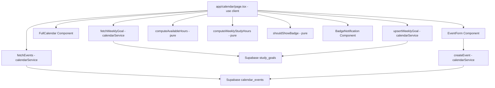
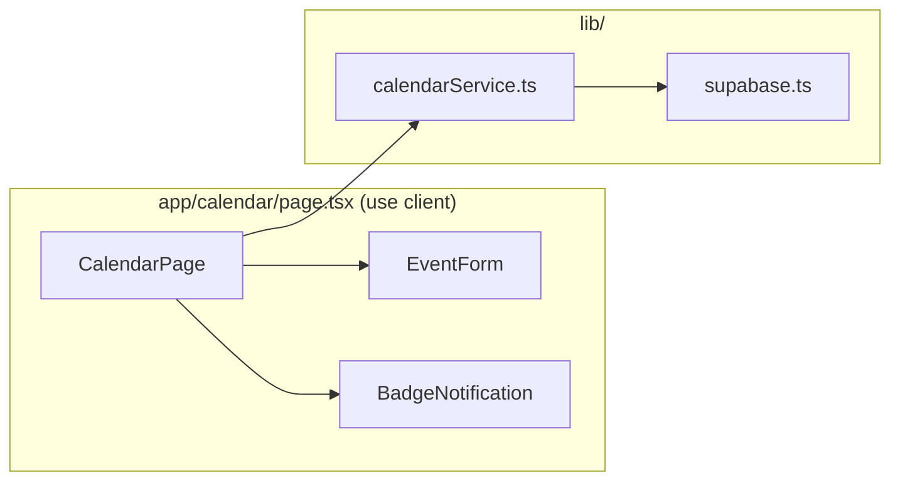

# Design Document: Calendar Scheduler

## Overview

The Calendar Scheduler adds a `/calendar` page to Study Buddy that gives students a visual monthly calendar for managing scheduled events. Students can create events (classes, tasks, work shifts, personal commitments, appointments), see how many unscheduled hours remain today, track weekly study progress toward a personal goal, and receive in-page badge notifications when study milestones are reached.

All event data and the weekly goal are persisted in Supabase. The calendar is rendered using FullCalendar (`@fullcalendar/react` + `@fullcalendar/daygrid`), which requires a `'use client'` component.

### Key Design Decisions

- **FullCalendar as a client component**: FullCalendar uses browser APIs and cannot run server-side. The entire `/calendar` page is a `'use client'` component, consistent with the existing pattern in `Taskboard.tsx` and `NotificationBell.tsx`.
- **Separation of pure logic from I/O**: All computation functions (`computeAvailableHours`, `computeWeeklyStudyHours`, `deriveColor`, `isValidEvent`, `isValidWeeklyGoal`, `shouldShowBadge`) are pure functions in `lib/calendarService.ts`, keeping them fully unit- and property-testable without mocking Supabase.
- **Single-row upsert for weekly goal**: The `study_goals` table uses a single-row upsert pattern (fixed `id = 1`) rather than per-user rows, consistent with the no-auth constraint.
- **Color derived at creation time**: The `color` field is computed from the `Color_Map` and stored in Supabase at insert time, so the calendar view never needs to re-derive it.
- **Badge state is session-local**: Badge "already shown" state is held in React `useRef` (not persisted), so badges can re-appear on a fresh page load — which is the desired motivational behavior.
- **In-page badges, not `alert()`**: Badges render as dismissible DOM elements, matching the requirements and avoiding the UX problems of browser dialogs.
- **ISO week definition**: The current week runs Monday 00:00 through Sunday 23:59 local time, consistent with the requirements glossary.

---

## Architecture



### Component Interaction



---

## Components and Interfaces

### New Files

| File | Type | Responsibility |
|------|------|----------------|
| `lib/calendarService.ts` | Service module | Pure computation functions + Supabase CRUD for events and weekly goal |
| `app/calendar/page.tsx` | `'use client'` page component | Calendar view, event form, available hours, weekly progress, badges |
| `app/styles/Calendar.css` | CSS | Styles for the calendar page |

### `calendarService.ts` Public API

```typescript
// ─── Types ────────────────────────────────────────────────────────────────────

export type EventType = 'class' | 'task' | 'work' | 'personal' | 'appointment';

export interface CalendarEvent {
  id: string;           // UUID, assigned by Supabase
  title: string;
  type: EventType;
  start: string;        // ISO timestamptz
  end: string | null;   // ISO timestamptz, nullable
  color: string;        // hex color derived from Color_Map
  created_at: string;   // ISO timestamptz
}

export interface CalendarEventFormValues {
  title: string;
  type: EventType;
  start: string;        // datetime-local value (ISO-compatible)
  end: string;          // datetime-local value, may be empty string
}

export interface WeeklyGoal {
  id: number;           // always 1 (single-row pattern)
  weekly_goal: number;
  updated_at: string;
}

// ─── Color Map (pure constant) ────────────────────────────────────────────────

export const COLOR_MAP: Record<EventType, string> = {
  class:       '#4e73df',
  task:        '#e74a3b',
  work:        '#36b9cc',
  personal:    '#1cc88a',
  appointment: '#f6c23e',
};

// ─── Pure computation functions ───────────────────────────────────────────────

/** Returns the hex color for a given event type from COLOR_MAP. */
export function deriveColor(type: EventType): string

/**
 * Validates a CalendarEventFormValues object.
 * Returns null if valid, or an error message string if invalid.
 * Rules:
 *   - title must be non-empty (not purely whitespace)
 *   - start must be non-empty
 *   - if end is non-empty, end must be strictly after start
 */
export function validateEventForm(values: CalendarEventFormValues): string | null

/** Returns true if goal is an integer >= 1. */
export function isValidWeeklyGoal(value: unknown): value is number

/**
 * Computes available hours for a given local date.
 * Formula: max(0, 24 - 8 - totalEventHoursOnDate)
 * Only counts events whose start date (local) matches dateStr (YYYY-MM-DD)
 * and that have a non-null end.
 */
export function computeAvailableHours(events: CalendarEvent[], dateStr: string): number

/**
 * Computes total study hours for the ISO week containing referenceDate.
 * Only counts events whose title contains "study" (case-insensitive),
 * whose start falls within Monday 00:00–Sunday 23:59 local time of that week,
 * and that have a non-null end.
 * Duration = (end - start) in hours.
 */
export function computeWeeklyStudyHours(events: CalendarEvent[], referenceDate: Date): number

/**
 * Returns the ISO week bounds (Monday 00:00 and Sunday 23:59:59.999) for a given date,
 * in local time.
 */
export function getISOWeekBounds(date: Date): { weekStart: Date; weekEnd: Date }

/**
 * Returns true if the badge should be shown.
 * alreadyShown: whether this badge has already been displayed this session.
 * condition: whether the trigger condition is currently met.
 */
export function shouldShowBadge(alreadyShown: boolean, condition: boolean): boolean

// ─── Supabase I/O functions ───────────────────────────────────────────────────

/** Fetches all events ordered by start ascending. */
export async function fetchEvents(): Promise<CalendarEvent[]>

/** Inserts a new event and returns the created row. */
export async function createEvent(values: CalendarEventFormValues): Promise<CalendarEvent>

/** Fetches the stored weekly goal. Returns null if none exists. */
export async function fetchWeeklyGoal(): Promise<number | null>

/** Upserts the weekly goal (single-row, id=1). */
export async function upsertWeeklyGoal(goal: number): Promise<void>
```

### `app/calendar/page.tsx` Component

```typescript
'use client';

// Internal state:
// - events: CalendarEvent[]          — loaded from Supabase
// - weeklyGoal: number               — loaded from Supabase, default 0
// - goalInput: string                — controlled input value
// - formValues: CalendarEventFormValues
// - formError: string | null         — validation or submission error
// - loading: boolean
// - pageError: string | null         — fetch error
// - streakBadgeShown: React.MutableRefObject<boolean>
// - goalBadgeShown: React.MutableRefObject<boolean>
// - activeBadges: ('streak' | 'goal')[]  — badges currently displayed

export default function CalendarPage(): JSX.Element
```

---

## Data Models

### `CalendarEvent` Type

```typescript
export type EventType = 'class' | 'task' | 'work' | 'personal' | 'appointment';

export interface CalendarEvent {
  id: string;
  title: string;
  type: EventType;
  start: string;        // ISO timestamptz
  end: string | null;
  color: string;
  created_at: string;
}
```

### Supabase `calendar_events` Table Schema

```sql
create table calendar_events (
  id         uuid primary key default gen_random_uuid(),
  title      text not null,
  type       text not null check (type in ('class', 'task', 'work', 'personal', 'appointment')),
  start      timestamptz not null,
  "end"      timestamptz,
  color      text not null,
  created_at timestamptz not null default now()
);

create index calendar_events_start_idx on calendar_events(start asc);
```

### Supabase `study_goals` Table Schema

```sql
create table study_goals (
  id          integer primary key default 1,
  weekly_goal integer not null check (weekly_goal >= 1),
  updated_at  timestamptz not null default now(),
  constraint  study_goals_single_row check (id = 1)
);
```

The single-row constraint enforces that only one goal record can exist. Upserts use `on conflict (id) do update`.

### Color Map

| Event Type    | Hex Color   |
|---------------|-------------|
| `class`       | `#4e73df`   |
| `task`        | `#e74a3b`   |
| `work`        | `#36b9cc`   |
| `personal`    | `#1cc88a`   |
| `appointment` | `#f6c23e`   |

### Available Hours Formula

```
totalEventHoursToday = sum of (end - start) in hours
                       for all events where:
                         - start date (local) === today's date (local)
                         - end is not null

availableHours = max(0, 24 - 8 - totalEventHoursToday)
```

### Weekly Study Hours Formula

```
weekStart = Monday 00:00:00.000 local time of the current ISO week
weekEnd   = Sunday 23:59:59.999 local time of the current ISO week

weeklyStudyHours = sum of (end - start) in hours
                   for all events where:
                     - title.toLowerCase().includes('study')
                     - start >= weekStart AND start <= weekEnd
                     - end is not null
```

---

## Correctness Properties

*A property is a characteristic or behavior that should hold true across all valid executions of a system — essentially, a formal statement about what the system should do. Properties serve as the bridge between human-readable specifications and machine-verifiable correctness guarantees.*

### Property 1: Color derivation is consistent with Color_Map

*For any* valid `EventType`, `deriveColor(type)` SHALL return the exact hex color defined in `COLOR_MAP` for that type.

**Validates: Requirements 1.3, 3.3**

---

### Property 2: Event form validation rejects missing title or start

*For any* `CalendarEventFormValues` where `title` is empty or purely whitespace, or where `start` is empty, `validateEventForm` SHALL return a non-null error string and SHALL NOT return null.

**Validates: Requirements 2.3**

---

### Property 3: Event form validation rejects end ≤ start

*For any* `CalendarEventFormValues` where `end` is non-empty and `end` is less than or equal to `start`, `validateEventForm` SHALL return a non-null error string.

**Validates: Requirements 2.4**

---

### Property 4: Available hours formula correctness

*For any* list of `CalendarEvent` objects and any local date string, `computeAvailableHours` SHALL return `max(0, 16 - totalEventHoursOnDate)`, where `totalEventHoursOnDate` is the sum of `(end - start)` in hours for all events whose local start date matches the given date string and whose `end` is non-null. Events on other dates or with null `end` SHALL NOT contribute to the total.

**Validates: Requirements 4.2, 4.3**

---

### Property 5: Weekly study hours computation correctness

*For any* list of `CalendarEvent` objects and any reference `Date`, `computeWeeklyStudyHours` SHALL return the sum of `(end - start)` in hours only for events that (a) have "study" (case-insensitive) in their title, (b) have a `start` within the ISO week containing `referenceDate`, and (c) have a non-null `end`. Events outside the week, without "study" in the title, or with null `end` SHALL NOT contribute.

**Validates: Requirements 5.2, 5.3**

---

### Property 6: Weekly goal validation rejects invalid inputs

*For any* value that is not a positive integer (i.e., any number < 1, any non-integer, or any non-numeric value), `isValidWeeklyGoal` SHALL return `false`.

**Validates: Requirements 6.5**

---

### Property 7: Badge is shown exactly once per session

*For any* badge, if `alreadyShown` is `true`, `shouldShowBadge` SHALL return `false` regardless of whether the trigger condition is met. If `alreadyShown` is `false` and `condition` is `true`, `shouldShowBadge` SHALL return `true`.

**Validates: Requirements 7.1, 7.2, 7.5**

---

## Error Handling

### Supabase Fetch Failure on Load

If `fetchEvents` or `fetchWeeklyGoal` throws during page mount, the `CalendarPage` catches the error and sets `pageError` state, rendering a descriptive error message. The page does not crash. The calendar renders empty.

### Event Creation Failure

If `createEvent` throws, the `CalendarPage` sets `formError` state and displays the error message near the form. The form retains all entered values so the student does not lose their input.

### Supabase CRUD Pattern

All Supabase calls in `calendarService.ts` follow the same pattern as `taskService.ts` and `notificationService.ts`: check the `error` field and throw `new Error(error.message)`. The calling component is responsible for catching and displaying the error.

### Invalid Goal Input

If the student enters a value that fails `isValidWeeklyGoal`, the `CalendarPage` does not call `upsertWeeklyGoal` and retains the previous valid goal value in state. No error is thrown to Supabase.

### FullCalendar SSR

FullCalendar is a browser-only library. The `'use client'` directive on `app/calendar/page.tsx` ensures it is never rendered server-side. No dynamic import with `ssr: false` is needed because the entire page is already a client component.

---

## Testing Strategy

### Testing Approach

This feature uses a dual testing approach:

- **Unit tests** (`tests/calendar/calendarService.unit.test.ts`): Verify specific examples, edge cases, and error conditions for the pure functions in `calendarService.ts`.
- **Property-based tests** (`tests/calendar/calendarService.property.test.ts`): Verify the correctness properties above using `fast-check` (already a project dependency). Each property test runs a minimum of 100 iterations.

### Property Test Configuration

Each property test is tagged with a comment referencing the design property:

```typescript
// Feature: calendar-scheduler, Property N: <property_text>
fc.assert(fc.property(...), { numRuns: 100 });
```

### Unit Test Coverage

Key unit test cases for pure functions:

- `deriveColor`: returns correct hex for each of the five event types
- `validateEventForm`: accepts valid title + start; rejects empty title; rejects whitespace-only title; rejects missing start; rejects end <= start; accepts missing end (end-time is optional)
- `isValidWeeklyGoal`: accepts 1, 5, 100; rejects 0, -1, 0.5, NaN, "abc", null, undefined
- `computeAvailableHours`: returns 16 for empty event list; returns 0 when events fill more than 16 hours; ignores events on other dates; ignores events with null end
- `computeWeeklyStudyHours`: returns 0 for empty list; counts only "study" events; ignores events outside the ISO week; ignores events with null end; is case-insensitive for "study" matching
- `getISOWeekBounds`: Monday is week start; Sunday is week end; handles week boundaries correctly
- `shouldShowBadge`: returns false when alreadyShown=true; returns true when alreadyShown=false and condition=true; returns false when alreadyShown=false and condition=false

### Property Test Coverage

Each correctness property maps to one property-based test:

| Property | Test Description |
|----------|-----------------|
| Property 1 | `deriveColor` matches `COLOR_MAP` for all valid event types |
| Property 2 | `validateEventForm` rejects any input with empty/whitespace title or empty start |
| Property 3 | `validateEventForm` rejects any input where end ≤ start |
| Property 4 | `computeAvailableHours` equals `max(0, 16 - sumOfTodayEventHours)` for any event list |
| Property 5 | `computeWeeklyStudyHours` sums only qualifying study events for any event list and reference date |
| Property 6 | `isValidWeeklyGoal` returns false for any value < 1 or non-integer |
| Property 7 | `shouldShowBadge` returns false when alreadyShown=true, regardless of condition |

### Integration Tests

Not required for this feature. All Supabase interactions are thin wrappers following the established pattern from `taskService.ts`. The FullCalendar component is a third-party library and does not require integration testing.

### FullCalendar Dependency Installation

Before implementing, install the required packages:

```bash
npm install @fullcalendar/react @fullcalendar/daygrid
```
