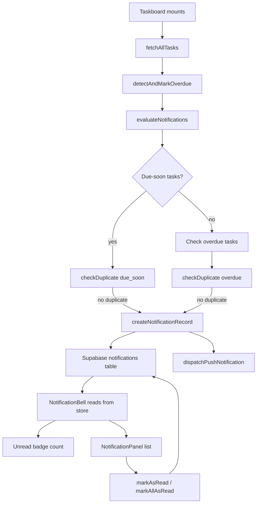
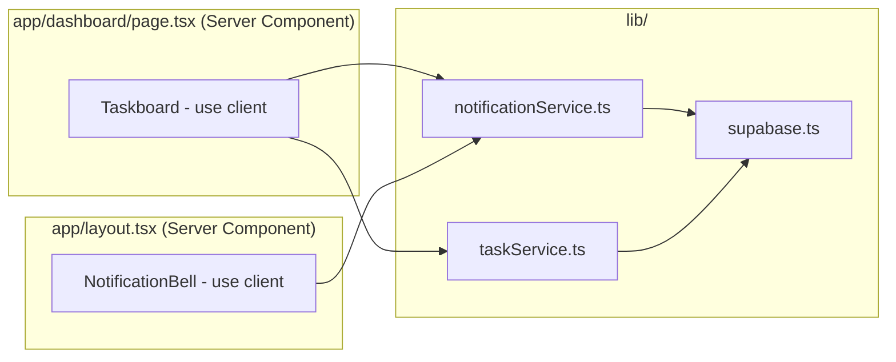

# Design Document: Notifications

## Overview

The Notifications feature adds proactive, student-focused alerts to Study Buddy. It surfaces due-soon and overdue task alerts both inside the app (via a persistent notification panel in the navbar) and as browser push notifications using the Web Notifications API.

The design is intentionally lightweight: no service worker, no external push service, no auth scoping. Notification evaluation runs client-side on dashboard mount, triggered by the existing task-loading flow in `Taskboard`. Notification records are persisted in a new Supabase `notifications` table so students can review past alerts across sessions.

### Key Design Decisions

- **Client-side evaluation only**: Notifications are evaluated when the dashboard loads, not on a server schedule. This keeps the implementation simple and avoids the need for background jobs or cron triggers.
- **Deduplication by unread state**: Rather than tracking "has this notification ever been sent", the system deduplicates by checking for existing *unread* notifications for a given `task_id` and `type`. This means a student who reads and dismisses a notification will receive a new one if the task is still due-soon or overdue on the next load — which is the desired behavior.
- **No service worker**: The browser `Notification` API (`window.Notification`) is used directly. This means push notifications only fire while the tab is open, which is acceptable for this use case.
- **Separation of pure logic from I/O**: The notification evaluation logic (detecting due-soon/overdue tasks, building notification records, deduplication checks) is implemented as pure functions in a `notificationService.ts` module. Supabase reads/writes and browser API calls are kept in thin wrappers, making the core logic fully unit-testable.

---

## Architecture



### Component Interaction



---

## Components and Interfaces

### New Files

| File | Type | Responsibility |
|------|------|----------------|
| `lib/notificationService.ts` | Service module | Pure evaluation logic + Supabase CRUD for notifications |
| `app/components/NotificationBell.tsx` | `'use client'` component | Bell icon, unread badge, panel toggle, panel rendering |

### Modified Files

| File | Change |
|------|--------|
| `app/layout.tsx` | Replace `<Navbar />` with `<Navbar />` unchanged; add `<NotificationBell />` inside Navbar or alongside it |
| `app/components/Navbar.tsx` | Convert to `'use client'`, import and render `<NotificationBell />` |
| `app/components/Taskboard.tsx` | Call `evaluateNotifications(tasks)` after tasks load |
| `lib/types.ts` | Add `Notification` and `NotificationType` types |

### `NotificationBell` Component Interface

```typescript
// app/components/NotificationBell.tsx
'use client';

// Props: none — fetches its own data from notificationService
export default function NotificationBell(): JSX.Element
```

Internal state:
- `notifications: Notification[]` — all stored notifications, ordered by `created_at` desc
- `isOpen: boolean` — panel open/closed toggle
- `loading: boolean` — initial fetch state

### `notificationService.ts` Public API

```typescript
// Pure evaluation functions (no I/O — fully testable)
export function isDueSoon(task: Task, now: Date): boolean
export function buildNotificationRecord(
  task: Task,
  type: NotificationType,
  now: Date
): Omit<Notification, 'id'>
export function shouldCreateNotification(
  task: Task,
  type: NotificationType,
  existing: Notification[]
): boolean
export function filterDueSoonTasks(tasks: Task[], now: Date): Task[]
export function filterOverdueTasks(tasks: Task[]): Task[]
export function sortNotificationsDesc(notifications: Notification[]): Notification[]
export function computeUnreadCount(notifications: Notification[]): number
export function markNotificationsForTaskAsRead(
  notifications: Notification[],
  taskId: string
): Notification[]
export function removeNotificationsForTask(
  notifications: Notification[],
  taskId: string
): Notification[]
export function formatPushBody(notification: Notification): string

// I/O functions (Supabase + browser API)
export async function fetchNotifications(): Promise<Notification[]>
export async function createNotification(record: Omit<Notification, 'id'>): Promise<Notification>
export async function markAsRead(notificationId: string): Promise<void>
export async function markAllAsRead(): Promise<void>
export async function markNotificationsReadForTask(taskId: string): Promise<void>
export async function deleteNotificationsForTask(taskId: string): Promise<void>
export async function evaluateNotifications(tasks: Task[]): Promise<void>
export function requestPushPermission(): Promise<void>
export function dispatchPushNotification(notification: Notification): void
```

---

## Data Models

### `Notification` Type (added to `lib/types.ts`)

```typescript
export type NotificationType = 'due_soon' | 'overdue';

export interface Notification {
  id: string;               // UUID, assigned by Supabase
  task_id: string;
  task_name: string;
  subject: string;
  due_date: string;         // YYYY-MM-DD
  priority: Priority;
  type: NotificationType;
  read: boolean;
  created_at: string;       // ISO timestamp
}
```

### Supabase `notifications` Table Schema

```sql
create table notifications (
  id          uuid primary key default gen_random_uuid(),
  task_id     uuid not null,
  task_name   text not null,
  subject     text not null,
  due_date    date not null,
  priority    text not null check (priority in ('Low', 'Medium', 'High')),
  type        text not null check (type in ('due_soon', 'overdue')),
  read        boolean not null default false,
  created_at  timestamptz not null default now()
);

create index notifications_task_id_idx on notifications(task_id);
create index notifications_created_at_idx on notifications(created_at desc);
```

### Due-Soon Detection Logic

A task is "due soon" if:
- `task.status` is `'Unstarted'` or `'In Progress'`
- `task.due_date` (parsed as midnight UTC on that date) is within the next 24 hours from `now`

```
dueSoonThresholdMs = 24 * 60 * 60 * 1000
taskDueMs = Date.parse(task.due_date + 'T00:00:00Z')
isDueSoon = taskDueMs > now.getTime() && taskDueMs <= now.getTime() + dueSoonThresholdMs
```

Note: tasks whose `due_date` is in the past are already `Overdue` (handled by `detectAndMarkOverdue` in Taskboard), so the `taskDueMs > now.getTime()` guard is a safety check.

---

## Correctness Properties

*A property is a characteristic or behavior that should hold true across all valid executions of a system — essentially, a formal statement about what the system should do. Properties serve as the bridge between human-readable specifications and machine-verifiable correctness guarantees.*

### Property 1: Due-soon filter correctness

*For any* list of tasks and any reference timestamp, every task returned by `filterDueSoonTasks` SHALL have status `'Unstarted'` or `'In Progress'` and a `due_date` that falls within the next 24 hours of the reference time, and no qualifying task shall be omitted.

**Validates: Requirements 1.1**

---

### Property 2: Overdue filter correctness

*For any* list of tasks, every task returned by `filterOverdueTasks` SHALL have status `'Overdue'`, and no task with status `'Overdue'` shall be omitted.

**Validates: Requirements 2.1**

---

### Property 3: Notification record completeness

*For any* task and notification type (`'due_soon'` or `'overdue'`), the record produced by `buildNotificationRecord` SHALL contain all required fields (`task_id`, `task_name`, `subject`, `due_date`, `priority`, `type`, `read`, `created_at`) with `read` set to `false`, `type` matching the input, and all task fields copied correctly from the source task.

**Validates: Requirements 1.2, 2.2**

---

### Property 4: Deduplication prevents duplicate unread notifications

*For any* task, notification type, and list of existing notifications that contains at least one unread notification of that type for that task, `shouldCreateNotification` SHALL return `false`. Conversely, when no unread notification of that type exists for that task, it SHALL return `true`.

**Validates: Requirements 1.3, 2.3**

---

### Property 5: Notifications are sorted in descending order

*For any* list of notifications, `sortNotificationsDesc` SHALL return a list where each notification's `created_at` is greater than or equal to the `created_at` of the next notification in the list.

**Validates: Requirements 3.3**

---

### Property 6: Unread badge count reflects unread notifications

*For any* list of notifications, `computeUnreadCount` SHALL return exactly the number of notifications whose `read` field is `false`.

**Validates: Requirements 4.2**

---

### Property 7: Marking one notification as read decrements unread count by one

*For any* list of notifications containing at least one unread notification, after applying `markNotificationsForTaskAsRead` for a task that has exactly one unread notification, the unread count SHALL decrease by exactly one.

**Validates: Requirements 4.6**

---

### Property 8: Mark all as read sets unread count to zero

*For any* list of notifications, after marking all as read, `computeUnreadCount` SHALL return zero and every notification in the list SHALL have `read` set to `true`.

**Validates: Requirements 4.7**

---

### Property 9: Push notification body contains required task information

*For any* notification record (of either type), `formatPushBody` SHALL return a string that contains the `task_name`, `subject`, and `due_date` of the notification.

**Validates: Requirements 5.3, 5.4**

---

### Property 10: Marking notifications for a task as read does not affect other tasks

*For any* task ID and list of notifications, after applying `markNotificationsForTaskAsRead` for that task ID, all notifications with a different `task_id` SHALL retain their original `read` value unchanged.

**Validates: Requirements 6.2**

---

### Property 11: Removing notifications for a task leaves other tasks' notifications intact

*For any* task ID and list of notifications, after applying `removeNotificationsForTask` for that task ID, no notification with that `task_id` SHALL remain, and all notifications with a different `task_id` SHALL be present and unchanged.

**Validates: Requirements 6.3**

---

## Error Handling

### Browser Notification API Unavailable

`dispatchPushNotification` and `requestPushPermission` check `typeof window !== 'undefined' && 'Notification' in window` before accessing the API. If unsupported, they return silently without throwing.

### Push Permission Denied

`evaluateNotifications` calls `dispatchPushNotification` only when `Notification.permission === 'granted'`. In-app notification records are always created regardless of push permission state.

### Supabase Errors

All Supabase calls in `notificationService.ts` follow the same pattern as `taskService.ts`: check `error` and throw `new Error(error.message)`. The `NotificationBell` component catches errors from `fetchNotifications` and renders a silent fallback (no panel, no badge) rather than crashing the page.

### Task Deletion Race Condition

`deleteNotificationsForTask` is called from `Taskboard` when a task is deleted. If the delete fails, the orphaned notification records are harmless — they will simply never match a live task. The `task_id` column does not have a foreign key constraint to avoid cascading issues.

---

## Testing Strategy

### Testing Approach

This feature uses a dual testing approach:

- **Unit tests** (`tests/notifications/notificationService.unit.test.ts`): Verify specific examples, edge cases, and error conditions for the pure functions in `notificationService.ts`.
- **Property-based tests** (`tests/notifications/notificationService.property.test.ts`): Verify the correctness properties above using `fast-check` (already a project dependency). Each property test runs a minimum of 100 iterations.

UI component behavior (badge rendering, panel toggle, notification list rendering) is tested with `@testing-library/react` (already a project dependency) in `tests/notifications/NotificationBell.test.tsx`.

### Property Test Configuration

Each property test is tagged with a comment referencing the design property:

```typescript
// Feature: notifications, Property N: <property_text>
fc.assert(fc.property(...), { numRuns: 100 });
```

### Unit Test Coverage

Key unit test cases:
- `isDueSoon`: task due exactly at the 24-hour boundary (inclusive/exclusive edge)
- `isDueSoon`: task already overdue (due_date in the past) returns false
- `buildNotificationRecord`: correct `type`, `read=false`, all fields populated
- `shouldCreateNotification`: returns false when unread notification exists; true when only read notifications exist
- `evaluateNotifications`: calls `dispatchPushNotification` only when permission is `'granted'`
- `dispatchPushNotification`: does not throw when `window.Notification` is undefined
- `requestPushPermission`: does not throw when `window.Notification` is undefined

### Component Test Coverage

- `NotificationBell` renders bell icon
- `NotificationBell` shows badge when unread count > 0; hides badge when count is 0
- `NotificationBell` toggles panel open/closed on click
- `NotificationBell` shows "No notifications yet." when notification list is empty
- `NotificationBell` calls `markAsRead` when a notification item is clicked
- `NotificationBell` calls `markAllAsRead` when "Mark all as read" is clicked

### Integration Tests

Not required for this feature. All Supabase interactions are thin wrappers over the same `supabase` client used throughout the project and follow established patterns from `taskService.ts`.
