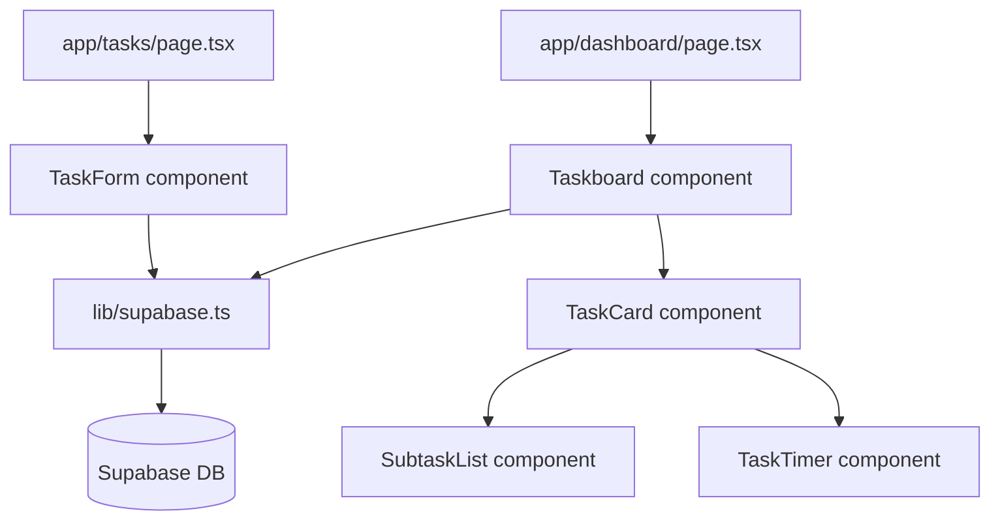

# Design Document: Task Creation

## Overview

This document describes the technical design for the Task Creation feature of the Smart Study Planner. The feature transforms the existing static `/tasks` form and hardcoded `Taskboard` into a fully functional, Supabase-backed task management system supporting task CRUD, status lifecycle, time tracking, subtasks, and completion metadata.

The implementation targets Next.js 16 (App Router), React 19, TypeScript, Supabase JS v2, and Tailwind CSS v4. No authentication is required at this stage — all operations are anonymous.

---

## Architecture

The system follows a client-side data-fetching pattern. React components own local state and call Supabase directly via a shared client singleton. There is no server-side API layer — all Supabase calls happen in client components using `'use client'`.



Overdue detection is handled client-side: when the Taskboard fetches tasks, it compares each task's `due_date` against the current date and issues a batch `UPDATE` for any tasks that should be Overdue but aren't yet.

---

## Components and Interfaces

### New / Modified Components

| Component | Path | Role |
|---|---|---|
| `TaskForm` | `app/components/TaskForm.tsx` | Controlled form for create/edit. Replaces static form in `app/tasks/page.tsx` |
| `Taskboard` | `app/components/Taskboard.tsx` | Rewritten — fetches tasks, groups by status, renders TaskCards |
| `TaskCard` | `app/components/TaskCard.tsx` | Displays a single task with actions (edit, delete, start, complete) |
| `SubtaskList` | `app/components/SubtaskList.tsx` | Renders subtasks nested under a TaskCard; handles add/edit/delete/toggle |
| `TaskTimer` | `app/components/TaskTimer.tsx` | Start/stop timer UI; shows elapsed time and total accumulated time |
| `lib/supabase.ts` | `lib/supabase.ts` | Supabase client singleton |

### Page Changes

- `app/tasks/page.tsx` — becomes a `'use client'` page that renders `<TaskForm />` and accepts an optional `taskId` search param for edit mode
- `app/dashboard/page.tsx` — no structural change; `Taskboard` is now a client component

---

## Data Models

### Database Schema

```sql
-- Tasks
create table tasks (
  id          uuid primary key default gen_random_uuid(),
  name        text not null check (char_length(name) <= 100),
  subject     text not null check (char_length(subject) <= 50),
  due_date    date not null,
  priority    text not null check (priority in ('Low', 'Medium', 'High')),
  status      text not null default 'Unstarted'
                check (status in ('Unstarted', 'In Progress', 'Complete', 'Overdue')),
  description text check (char_length(description) <= 500),
  created_at  timestamptz default now()
);

-- Subtasks
create table subtasks (
  id          uuid primary key default gen_random_uuid(),
  task_id     uuid not null references tasks(id) on delete cascade,
  name        text not null check (char_length(name) <= 100),
  description text check (char_length(description) <= 500),
  completed   boolean not null default false,
  created_at  timestamptz default now()
);

-- Time sessions
create table time_sessions (
  id         uuid primary key default gen_random_uuid(),
  task_id    uuid not null references tasks(id) on delete cascade,
  started_at timestamptz not null,
  ended_at   timestamptz
);

-- Completion records
create table completion_records (
  id                  uuid primary key default gen_random_uuid(),
  task_id             uuid not null references tasks(id) on delete cascade,
  completed_at        timestamptz not null,
  due_date            date not null,
  outcome             text not null check (outcome in ('ahead of time', 'on time', 'overdue'))
);
```

### TypeScript Types

```typescript
// lib/types.ts

export type Priority = 'Low' | 'Medium' | 'High';
export type TaskStatus = 'Unstarted' | 'In Progress' | 'Complete' | 'Overdue';
export type CompletionOutcome = 'ahead of time' | 'on time' | 'overdue';

export interface Task {
  id: string;
  name: string;
  subject: string;
  due_date: string;        // ISO date string YYYY-MM-DD
  priority: Priority;
  status: TaskStatus;
  description?: string;
  created_at: string;
}

export interface Subtask {
  id: string;
  task_id: string;
  name: string;
  description?: string;
  completed: boolean;
  created_at: string;
}

export interface TimeSession {
  id: string;
  task_id: string;
  started_at: string;      // ISO timestamp
  ended_at?: string;       // null if active
}

export interface CompletionRecord {
  id: string;
  task_id: string;
  completed_at: string;
  due_date: string;
  outcome: CompletionOutcome;
}

export interface TaskFormValues {
  name: string;
  subject: string;
  due_date: string;
  priority: Priority;
  description: string;
}

export interface ValidationErrors {
  name?: string;
  subject?: string;
  due_date?: string;
  priority?: string;
  description?: string;
}
```

---

## Supabase Client Setup

```typescript
// lib/supabase.ts
import { createClient } from '@supabase/supabase-js';

const supabaseUrl = process.env.NEXT_PUBLIC_SUPABASE_URL!;
const supabaseAnonKey = process.env.NEXT_PUBLIC_SUPABASE_ANON_KEY!;

export const supabase = createClient(supabaseUrl, supabaseAnonKey);
```

---

## Data Flow

### Form Submission (Create)

```
User fills TaskForm
  → validateForm(values): ValidationErrors
  → if errors: display inline errors, block submit
  → setLoading(true), disable submit button
  → supabase.from('tasks').insert({ ...values, status: 'Unstarted' })
  → on success: show success message, reset form fields
  → on error: show error message, retain field values
  → setLoading(false)
```

### Form Submission (Edit)

```
TaskCard edit button clicked
  → navigate to /tasks?taskId=<id>  (or open modal)
  → TaskForm fetches existing task, populates fields
  → User edits and submits
  → supabase.from('tasks').update({ ...values }).eq('id', taskId)
  → on success: navigate back / close modal, Taskboard refetches
```

### Taskboard Fetch + Overdue Detection

```
Taskboard mounts
  → setLoading(true)
  → supabase.from('tasks').select('*, subtasks(*), time_sessions(*), completion_records(*)')
  → detectAndMarkOverdue(tasks):
      filter tasks where due_date < today AND status in ['Unstarted', 'In Progress']
      supabase.from('tasks').update({ status: 'Overdue' }).in('id', overdueIds)
  → group tasks by status into { Unstarted, InProgress, Complete, Overdue }
  → setTasks(grouped), setLoading(false)
  → on error: setError(message)
```

### Status Transitions

```
Start work (Unstarted → In Progress):
  supabase.from('tasks').update({ status: 'In Progress' }).eq('id', id)
  → optimistic update in local state

Mark complete:
  1. supabase.from('tasks').update({ status: 'Complete' }).eq('id', id)
  2. compute outcome from completedAt vs due_date
  3. supabase.from('completion_records').insert({ task_id, completed_at, due_date, outcome })
  4. if active time session: stop it (see timer flow)
  → optimistic update in local state

Delete task:
  show confirmation prompt
  → supabase.from('tasks').delete().eq('id', id)  (cascades to subtasks, sessions, records)
  → remove from local state
```

### Timer Flow

```
Start timer:
  supabase.from('time_sessions').insert({ task_id, started_at: new Date().toISOString() })
  → store returned session id in component state
  → start setInterval to update elapsed display every second

Stop timer:
  supabase.from('time_sessions').update({ ended_at: new Date().toISOString() }).eq('id', activeSessionId)
  → clear interval
  → recompute total accumulated time from all sessions
```

### Subtask Operations

```
Add:    supabase.from('subtasks').insert({ task_id, name, description })
Toggle: supabase.from('subtasks').update({ completed: !current }).eq('id', subtaskId)
Edit:   supabase.from('subtasks').update({ name, description }).eq('id', subtaskId)
Delete: supabase.from('subtasks').delete().eq('id', subtaskId)
All operations → optimistic local state update, rollback on error
```

---

## State Management

All state is managed with React `useState` and `useEffect` hooks — no external library needed.

### Taskboard State

```typescript
const [tasks, setTasks] = useState<Record<TaskStatus, Task[]>>({
  Unstarted: [], 'In Progress': [], Complete: [], Overdue: []
});
const [loading, setLoading] = useState(true);
const [error, setError] = useState<string | null>(null);
```

### TaskForm State

```typescript
const [values, setValues] = useState<TaskFormValues>(defaultValues);
const [errors, setErrors] = useState<ValidationErrors>({});
const [submitting, setSubmitting] = useState(false);
const [submitStatus, setSubmitStatus] = useState<'idle' | 'success' | 'error'>('idle');
```

### TaskTimer State (per TaskCard)

```typescript
const [activeSessionId, setActiveSessionId] = useState<string | null>(null);
const [elapsedSeconds, setElapsedSeconds] = useState(0);
const [totalSeconds, setTotalSeconds] = useState(0); // sum of all ended sessions
const [timerError, setTimerError] = useState<string | null>(null);
```

State updates use optimistic patterns: update local state immediately, then sync to Supabase. On error, revert to previous state and show an error message.

---

## Overdue Detection Strategy

Overdue detection runs client-side on every Taskboard fetch:

```typescript
function computeOutcome(completedAt: Date, dueDate: string): CompletionOutcome {
  const due = new Date(dueDate);
  const completedDay = completedAt.toDateString();
  const dueDay = due.toDateString();
  if (completedAt < due) return 'ahead of time';
  if (completedDay === dueDay) return 'on time';
  return 'overdue';
}

async function detectAndMarkOverdue(tasks: Task[]): Promise<void> {
  const today = new Date().toISOString().split('T')[0];
  const overdueIds = tasks
    .filter(t => t.due_date < today && (t.status === 'Unstarted' || t.status === 'In Progress'))
    .map(t => t.id);
  if (overdueIds.length === 0) return;
  await supabase.from('tasks').update({ status: 'Overdue' }).in('id', overdueIds);
}
```

Rationale: A scheduled Supabase Edge Function would be more robust for production, but client-side detection on fetch is sufficient for this stage and avoids infrastructure complexity. The check is idempotent — running it multiple times produces the same result.

---

## Key Function Signatures

```typescript
// lib/taskService.ts

export async function fetchAllTasks(): Promise<Task[]>
export async function createTask(values: TaskFormValues): Promise<Task>
export async function updateTask(id: string, values: Partial<TaskFormValues>): Promise<Task>
export async function updateTaskStatus(id: string, status: TaskStatus): Promise<void>
export async function deleteTask(id: string): Promise<void>

export async function addSubtask(taskId: string, name: string, description?: string): Promise<Subtask>
export async function toggleSubtask(subtaskId: string, completed: boolean): Promise<void>
export async function updateSubtask(subtaskId: string, name: string, description?: string): Promise<void>
export async function deleteSubtask(subtaskId: string): Promise<void>

export async function startTimeSession(taskId: string): Promise<TimeSession>
export async function stopTimeSession(sessionId: string): Promise<TimeSession>
export function computeTotalSeconds(sessions: TimeSession[]): number

export async function recordCompletion(taskId: string, dueDate: string): Promise<CompletionRecord>
export function computeOutcome(completedAt: Date, dueDate: string): CompletionOutcome

// lib/validation.ts
export function validateTaskForm(values: TaskFormValues): ValidationErrors
```

---

## Error Handling

| Scenario | Behavior |
|---|---|
| Required field missing on submit | Inline error per field; submission blocked |
| Field exceeds character limit | Inline error with limit stated; submission blocked |
| Supabase insert error (task) | Error banner shown; form values retained |
| Supabase fetch error (taskboard) | Error message replaces task list |
| Supabase update/delete error | Error message shown; local state reverted |
| Timer start/stop error | Error shown on TaskTimer; timer not started/stopped |
| Subtask operation error | Error shown on SubtaskList; subtask reverted |

All Supabase calls are wrapped in try/catch. Errors are surfaced as user-readable strings, never raw Supabase error objects.

---


## Correctness Properties

*A property is a characteristic or behavior that should hold true across all valid executions of a system — essentially, a formal statement about what the system should do. Properties serve as the bridge between human-readable specifications and machine-verifiable correctness guarantees.*

### Property 1: Invalid form inputs are rejected

*For any* combination of form values where one or more required fields are empty, or where name exceeds 100 characters, or where description exceeds 500 characters, the `validateTaskForm` function should return a non-empty `ValidationErrors` object and no Supabase call should be made.

**Validates: Requirements 2.1, 2.2, 2.3, 2.4**

---

### Property 2: Task creation round trip

*For any* valid `TaskFormValues`, calling `createTask(values)` and then `fetchAllTasks()` should return a list that contains a task with matching name, subject, due_date, priority, description, and status equal to `'Unstarted'`.

**Validates: Requirements 3.1, 4.1**

---

### Property 3: Form resets after successful submission

*For any* valid form submission that succeeds, the resulting form state should have all fields equal to their default empty values.

**Validates: Requirements 3.3**

---

### Property 4: Tasks are grouped by status

*For any* set of tasks with varying statuses, the Taskboard's grouping function should place each task in exactly one section corresponding to its status, with no task appearing in a section that does not match its status.

**Validates: Requirements 4.2**

---

### Property 5: Task card displays required fields

*For any* task, the rendered `TaskCard` output should contain the task's name, subject, due date, priority, and status.

**Validates: Requirements 4.3**

---

### Property 6: Submit button is disabled while submitting

*For any* form state where `submitting` is `true`, the submit button's `disabled` attribute should be `true`.

**Validates: Requirements 5.1**

---

### Property 7: Overdue detection is correct and idempotent

*For any* set of tasks, after running `detectAndMarkOverdue`, every task whose `due_date` is strictly before today and whose status was `'Unstarted'` or `'In Progress'` should have status `'Overdue'`, and running the function a second time should produce no additional changes.

**Validates: Requirements 6.1**

---

### Property 8: Status transitions are persisted and reflected

*For any* task, calling `updateTaskStatus(id, newStatus)` and then fetching that task should return the task with the updated status. The local Taskboard state should also reflect the new status without a full page reload.

**Validates: Requirements 6.2, 6.3, 6.4, 6.5**

---

### Property 9: Edit round trip preserves all fields

*For any* existing task and any valid new `TaskFormValues`, submitting the edit form should result in the task record in the DB having exactly the new values, and the Taskboard should display the updated values.

**Validates: Requirements 7.1, 7.2**

---

### Property 10: Delete cascades to all associated records

*For any* task with associated subtasks, time sessions, and completion records, calling `deleteTask(id)` should result in the task, all its subtasks, all its time sessions, and all its completion records being absent from the DB.

**Validates: Requirements 7.4**

---

### Property 11: Completion outcome is computed correctly

*For any* `completedAt` date and `dueDate`, `computeOutcome(completedAt, dueDate)` should return:
- `'ahead of time'` when `completedAt` is before `dueDate`
- `'on time'` when `completedAt` is on the same calendar day as `dueDate`
- `'overdue'` when `completedAt` is after `dueDate` on a different calendar day

**Validates: Requirements 8.2, 8.3, 8.4**

---

### Property 12: Completion record is created on task completion

*For any* task marked complete, calling `recordCompletion(taskId, dueDate)` should insert a `CompletionRecord` with the correct `task_id`, `completed_at`, `due_date`, and `outcome` as computed by `computeOutcome`.

**Validates: Requirements 8.1, 8.5**

---

### Property 13: Timer session round trip

*For any* task, calling `startTimeSession(taskId)` should create a `TimeSession` with a non-null `started_at` and null `ended_at`. Subsequently calling `stopTimeSession(sessionId)` should update that record with a non-null `ended_at` that is after `started_at`.

**Validates: Requirements 9.1, 9.2**

---

### Property 14: Total accumulated time is sum of completed sessions

*For any* task with one or more completed `TimeSession` records, `computeTotalSeconds(sessions)` should equal the sum of `(ended_at - started_at)` in seconds for all sessions where `ended_at` is non-null.

**Validates: Requirements 9.4, 9.5**

---

### Property 15: Completing a task stops the active timer

*For any* task with an active `TimeSession` (null `ended_at`), marking the task as complete should result in that session having a non-null `ended_at`.

**Validates: Requirements 9.6**

---

### Property 16: Subtask mutations round trip

*For any* task and valid subtask data, each of the following should be reflected in the DB and local state:
- `addSubtask` → subtask exists with correct `task_id` and fields
- `toggleSubtask` → subtask `completed` field is flipped
- `updateSubtask` → subtask has new name/description values
- `deleteSubtask` → subtask no longer exists

**Validates: Requirements 10.1, 10.3, 10.4, 10.5**

---

### Property 17: Subtask field constraints are enforced

*For any* subtask name exceeding 100 characters or description exceeding 500 characters, the add or update operation should be rejected and no record should be inserted or modified.

**Validates: Requirements 10.2**

---

### Property 18: Subtasks are nested under correct parent

*For any* task with subtasks, the rendered Taskboard should display each subtask nested under the task whose `id` matches the subtask's `task_id`, and not under any other task.

**Validates: Requirements 10.6**

---

### Property 19: All-subtasks-complete indicator does not auto-complete parent

*For any* task where all associated subtasks have `completed = true`, the task's own `status` field should remain unchanged, and the UI should show a visual "all done" indicator without changing the parent task's status.

**Validates: Requirements 10.7**

---

## Error Handling

| Scenario | Behavior |
|---|---|
| Required field missing on submit | Inline error per field; submission blocked |
| Field exceeds character limit | Inline error with limit stated; submission blocked |
| Supabase insert error (task) | Error banner shown; form values retained |
| Supabase fetch error (taskboard) | Error message replaces task list |
| Supabase update/delete error | Error message shown; local state reverted to previous |
| Timer start/stop Supabase error | Error shown on TaskTimer; timer state unchanged |
| Subtask operation Supabase error | Error shown on SubtaskList; subtask state reverted |

All Supabase calls are wrapped in try/catch. Errors are surfaced as user-readable strings. Raw Supabase error objects are never exposed to the UI.

---

## Testing Strategy

### Dual Testing Approach

Both unit tests and property-based tests are required. They are complementary:
- Unit tests catch concrete bugs in specific scenarios and edge cases
- Property tests verify universal correctness across all valid inputs

### Unit Tests

Focus on:
- Specific examples: form renders with correct fields, empty section shows message, delete shows confirmation prompt
- Error conditions: Supabase error mocks for insert, fetch, update, delete, timer, subtask operations
- Edge cases: completion outcome boundary conditions (same-day, day before, day after)
- Integration points: TaskForm → Supabase insert, Taskboard → Supabase fetch

Avoid writing unit tests for behaviors already covered by property tests.

### Property-Based Tests

Library: **fast-check** (TypeScript-native, works with Jest/Vitest)

Install: `npm install --save-dev fast-check`

Each property test must:
- Run a minimum of **100 iterations**
- Include a comment tag referencing the design property

Tag format: `// Feature: task-creation, Property {N}: {property_text}`

Each correctness property above maps to exactly one property-based test:

| Property | Test description |
|---|---|
| P1 | `fc.record(...)` generates invalid form values; assert `validateTaskForm` returns errors |
| P2 | `fc.record(...)` generates valid form values; assert round-trip insert → fetch contains task |
| P3 | `fc.record(...)` generates valid values; assert form state resets after success |
| P4 | `fc.array(fc.record(...))` generates tasks; assert grouping places each in correct bucket |
| P5 | `fc.record(...)` generates tasks; assert rendered card contains all required fields |
| P6 | Assert submit button disabled when `submitting = true` |
| P7 | `fc.array(...)` generates tasks with varied dates/statuses; assert overdue detection is correct and idempotent |
| P8 | `fc.constantFrom(...)` generates status values; assert update → fetch returns new status |
| P9 | `fc.record(...)` generates edit values; assert round-trip edit → fetch returns new values |
| P10 | Generate task with subtasks/sessions/records; assert delete removes all |
| P11 | `fc.date()` generates completion and due dates; assert `computeOutcome` returns correct value |
| P12 | Generate tasks; assert `recordCompletion` inserts correct record |
| P13 | Generate tasks; assert start → stop session round trip |
| P14 | `fc.array(...)` generates sessions; assert `computeTotalSeconds` equals manual sum |
| P15 | Generate task with active session; assert completing task stops session |
| P16 | Generate subtask data; assert each mutation is reflected in DB and state |
| P17 | Generate subtask names/descriptions exceeding limits; assert rejection |
| P18 | Generate tasks with subtasks; assert each subtask nested under correct parent |
| P19 | Generate task with all subtasks complete; assert parent status unchanged |
